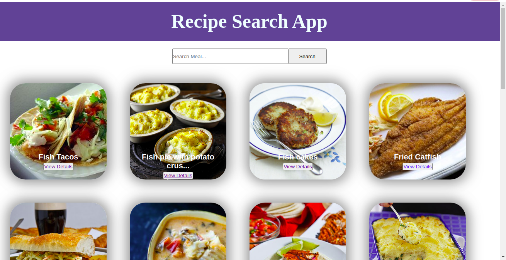

# Recipe Application

> The aim of this project is to create an application that shows the recipes of all foods around the world. The project is built in react and redux. The data is being processed from an API end point.

> The project conatins a search input at the header section of the main page. The search input filters the meals. To be able to search for meals you can type in words like
- Meat, fish, shrimps, beef, chicken, e.t.c. these single text are attached to the end of the api (`https://serene-gorge-49314.herokuapp.com/https://recipesapi.herokuapp.com/api/search?q=${text}`) as text and placed on the browser.





## Built With

- Javascript ES6
- WebPack
- HTML
- CSS
- React
- VS Code
- Redux


## How to Install

- Install Node in your system. To install Node, you can read the [Documentation](https://nodejs.org/en/download/package-manager/)
- Clone or download the zip file into your machine. CD into the folder and run

    ``` 
   npm install

    ``` 
- This will install all the dependancies.

  ``` 
  npm start

   ``` 

Runs the app in the development mode.\
Open [http://localhost:3000](http://localhost:3000) to view it in the browser.

The page will reload if you make edits.\
You will also see any lint errors in the console.


- To see the live site check here

[Live Demo Link](https://musing-torvalds-1f5773.netlify.app/)

- A description of the project and a demo of the project features 

[Live Demo Link](https://www.loom.com/share/2edf55fbadce438880fefb6765d39f7e)

- Programming Presentation video.

[Live Demo Link](https://www.loom.com/share/95363ddb707340d8870185e621494707)

- what excited you the most about software development during this course

[Live Demo Link](https://www.loom.com/share/dec3709e37cc4fa7a18a862ae973361f)

## Author

👤 **Morah Paul**

- GitHub:[@github/chinweokwu](https://github.com/chinweokwu)
- Linkedin:[linkedin/morah](https://www.linkedin.com/)


## 🤝 Contributing

Contributions, issues and feature requests are welcome!. Feel free to check the [issues page](issues/).

## Show your support

